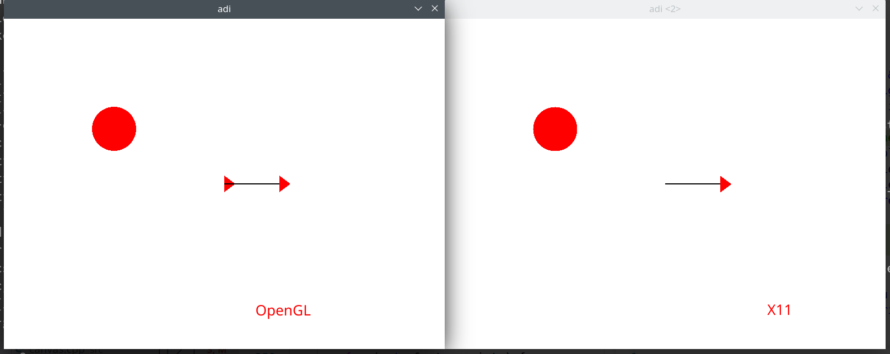

# simplecpp

This branch is for shifting the code to use OpenGL instead.

## Currect State



**simplecpp** is a simple 2D graphics library in C++.
It has very simple usage, with various examples in the `examples` directory.
The linux version is currently based on X11.

To learn how to use it, you can either just go through short examples in the examples directory, OR preferably watch the Lecture 1 and 5 of https://www.youtube.com/playlist?list=PLOzRYVm0a65eklyMDXGSWObRA-7lCdkSm

> Attribution- The original simplecpp package is available on https://cse.iitb.ac.in/~ranade/simplecpp and has been developed by [Prof. Abhiram Ranade](https://cse.iitb.ac.in/~ranade). I am just maintaining it to make it a little better for everyone to install and use :-)

## Installing

> Requires root permissions, use `sudo make install` if running as non-root
> Make sure `libx11` and `gcc/g++` are installed

```sh
make install         # That's it :D
```

This will build and install the library, headers, and the `s++` script, which you can (& should) use when working with simplecpp, it allows all arguments supported by gcc too.

### Available on AUR (Arch Linux)

simplecpp is also available on Arch User Repositories (AUR) as `simplecpp-git`.

Install it using,
```sh
yay -S simplecpp-git
```

## s++ usage

s++ is a script that takes care of the includes and linking libraries for you.
It will be automatically installed with `make install`, or you can only generate this s++ script, with `make s++`.

To use simplecpp, your source files should contain
```cpp
// main.cpp

#include <simplecpp>

int main() { turtleSim(); getClick(); }
```

And compile with
```sh
s++ main.cpp
```

> NOTE: If you like you can pass additional arguments to s++, like `s++ main.cpp -o main -lGL`

### Directory Structure

Simplecpp directory contains following subdirectories:

       include : contains C++ include files
       lib     : contains libsprite.a
       src     : source files
       examples: simple code examples, using simplecpp
       packages: packages built for easy installation on Arch Linux, etc.
       win     : windows specific code

### Future

-[] Reduce dynamic allocations
